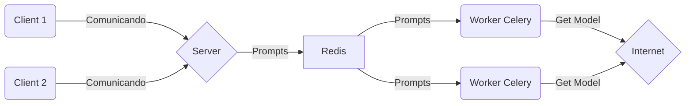

# Final Computación II - Universidad de Mendoza - San Rafael

> ## Profesor: Diego Cordoba --- Alumno: Marcos Miglierina

# Stable Diffusion con Celery

**Detalles del Proyecto**

Quiero armar una app, donde funcione con *[Stable Diffusión](https://stability.ai/)* que es una IA generadora de imágenes open source, utilizando Redis y Celery, para tener workers que sean los encargados de generar las imagenes y usuarios que solo envíen el prompt y reciban imagenes.

La idea principal del proyecto, es que computadoras que no son potentes, puedan generar imágenes utilizando otra computadora como generadora, y que el usuario no note esa ligera diferencia.

El gráfico de la arquitectura es la siguiente:

El gráfico tiene las siguientes entidades:

- **Client**: El cliente, es decir el usuario. Es el que tiene una interfaz, y tiene el input del prompt, es decir, el texto de la imagen a generar, y este lo envía al servidor. El cliente solo se comunica con el servidor.

- **Server**: El servidor, es donde se encuentra la base de datos y es el encargado de:

	- *Base de datos*: El servidor tiene una base de datos donde almacena las imagenes buscadas en un periodo de tiempo con su prompt.

	- *Client-Server*: El servidor se encarga de recibir los prompt de los clientes y compararlos con los almacenados en la base de datos, si hay match, devuelve las imagenes que tiene en la base de datos, sino manda el prompt al redis.

	- *Server-Redis*: Envía los prompts de los clientes al redis en caso de no hacer match en la base de datos y recibe las imágenes generadas, almacenándolos en el servidor y enviado la imagen a los clientes.

- **Redis**: Tiene una cola de tareas, donde recibe los prompts del servidor y las envia a los workers. Los workers se conectan al redist para recibir tareas. Los workers envian la imagen al redis y este las redirecciona al servidor.

- **Worker Celery**: Son los encargados de hacer el trabajo mas pesado, reciben los prompts que tiene el redis, y generan la imagen mediante IA, utilizando la placa de video. Una vez finalizado el renderizado de la imagen, la envía al redis como tarea completada y se queda esperando a realizar otra tarea. Solo se conecta al server para pedir el modelo en la instalación, una ves instalado todo, se queda comunicándose solamente con el redis.
	- *Worker-Internet:* Los workers necesitan del modelo entrenado para poder generar las imágenes, por lo que al momento de instalar todo lo necesario del worker para funcionar. Para evitar que el server se sature enviando archivos al worker, en el instalador del worker se agregará un link para descargar el modelo, tanto de la página principal [huggingface](https://huggingface.co/CompVis/stable-diffusion-v-1-4-original), como propio subido en [drive](https://drive.google.com/file/d/1qYQJ6tuSO6QzFZQuMUBXOBP1nlozODG9/view?usp=share_link) en caso de que hugginface fallé.